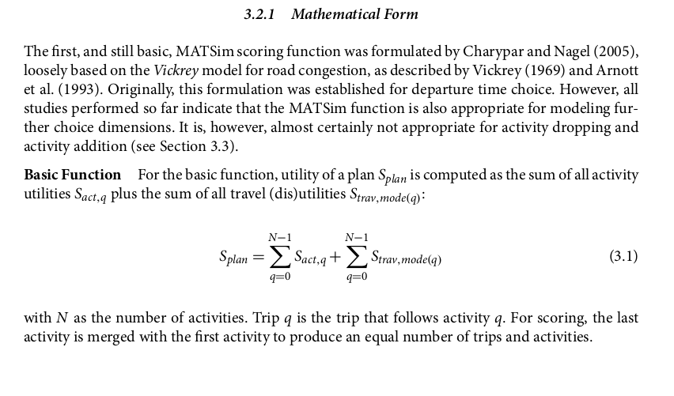
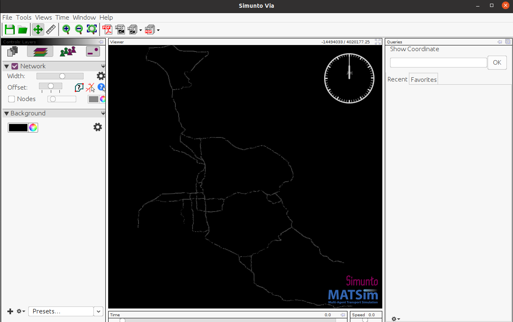

# Running Cluser flow optimization


# WARNING
I state this at the end because I wasted several hours trying to figure out this problem. Formatting the xml files with a pretty formatter of 
some sort can make the the xml files UNUSABLE for matsim. Your best bet is to remove all new lines and let the xml interpreter interpret the xml
file as is, you can view the xml file in pretty format for readability, but make sure to switch it back. It doesn't always happend, you'll notice
some of the xml files are pretty formatted, why this happens in some cases and not in others I don't know. 

# EV
Electric Vehicle functionality for MATSim

Make sure to run the following to compile the program

```
cd EvMatsim
mvn clean install -DskipTests
```

# Usage

First you need to create a conda environment with the appropriate dependencies, you may need to change some things based on your cuda
version.

The `./setup.sh` file will automatically setup the conda environment for you, again,  you may need to change the cuda version based on 
the specs of your machine.

## Installing the MatsimGraphEnv
In order to get the reinforcement learning working with Gymnasium, you need to install the environement, after running the `setup.sh` file
to setup the conda environment, run the following commands

```bash
conda activate matsimenv
cd Evmatsim/contribs/ev/evsim
pip install -e .
```
This should set the MatsimGraphEnv and register it with the gymnasium environments so you can run the `rl_algorithm.py` script.

## Running the Java Server
Once you have maven 3.8* installed and the Java JDK 21.* setup, you can run the java server as follows

```bash
cd /EvMatsim/contribs/ev
java -cp ./target/classes/ org.matsim.contrib.ev.RewardServer 100
```

The above command will spawn the server with 100 threads, ready to process incoming requests from the python client

## Running the Reinforcement learning python client 

Once the java server is up and running, and you've registered the environment with gymnasium you can run the python client to make requests, you should always create the same number
of environments for the number of threads on the server for the best performance.

```bash
cd /EvMatsim/contribs/ev
python rl_algorithm.py ./script_scenarios/tinytown_scenario_example/ev_tiny_town_config.xml
```

This will run the rl algorithm with the default parameters, you can run

```bash
python rl_algorithm.py --help
```

to get a description of the variables and what they mean.


## XML files

The MATsim simulator uses xml files to run the simulation and setup the configurations. In `scenarios/tinytown` you'll see the following xml files. The `run_algorithm.py` file automatically references these files and updates them according to your parameters.

## MATSim

The MATsim simulator works by simulating plans for agents specified in the `tiny_town_plans.xml` file. Each iteration each agent will keep a memory of $m$ length, here $m$ = 5, and run a greedy epsilon algorithm where $\epsilon=0.2$, meaning there is a 20% probability the agent will explore a new path, and an 80% probability the agent will select the path with the maximum utility score from its memory. The MATsim simulator will run for `NUM_MATSIM_ITERS` iterations trying to maximize the following function, from the MATsim book.




## UDOT data
[link to udot data](https://udot.iteris-pems.com/?chart_x=47&report_form=1&dow_0=on&dow_1=on&dow_2=on&dow_3=on&dow_4=on&dow_5=on&dow_6=on&tod=all&tod_from=0&tod_to=0&holidays=on&agg=on&s_time_id=1729641600&e_time_id=1730066340&fwy=15&dir=N&county_id=49035&station_id=6008&dnode=VDS)

# Working with MATSim - Isaac

This guide explains how to get a real-world network into MATSim, generate a population, and run a simulation. It assumes that you have the .jar executable compiled and ready to use.

## Getting a Real Network in MATSim

### Step 1: Download the Network

1. Visit [JOSM's website](https://josm.openstreetmap.de/) and download the `josm-tested.jar` file.
2. Run JOSM with the following command:

   ```bash
   java -jar josm-tested.jar
   ```

3. The JOSM interface should appear:
   
   

4. Enable expert mode by clicking on **View** and checking the **Expert mode** box.

5. Navigate to **File → Download Data**. In the download window, switch to the **Download from Overpass API** tab and enter a query.

### Example Overpass API Query

To download a bounding box of road data for the state of Utah, use:

```plaintext
[out:xml];
(
  way["highway"~"motorway|trunk"](39.647,-112.543,41.894,-111.148); //(min latitude, min longitude, max latitude, max longitude)
);
out body;
>;
out skel qt;
```

You can customize this query to include additional roadway types beyond `motorway` and `trunk`. The [Overpass API documentation](https://wiki.openstreetmap.org/wiki/Overpass_API) has more information.

#### Common Road Types:

- **motorway**: Highways or freeways with controlled access.
- **trunk**: Major roads that aren't motorways.
- **primary**, **secondary**, **tertiary**: Roads of varying levels of importance.
- **residential**: Streets within residential areas.
- **living_street**: Streets primarily for pedestrians with limited vehicle access.
- **service**: Roads for accessing buildings, parking lots, etc.
- **footway**, **cycleway**, **path**: Paths for pedestrians and cyclists.
- **track**: Roads mainly used for agricultural or forestry purposes.
- **unclassified**: Roads without a specific classification.

### Step 2: Edit the Network

In the JOSM editor, you can make sure that roads are connected properly. To display the map background, go to **Imagery → OpenStreetMap Carto (Standard)**.


Once you're satisfied with the network, save it by going to **File → Save As** and choosing `.osm` as the file format.

## Cleaning the .osm File

Use the script provided in `python/scripts/` named `clean_osm_data.py` to clean the `.osm` file. An example of how to run the script:

```bash
python python/scripts/clean_osm_data.py --input path/to/input_graph.osm --output path/to/cleaned_graph.osm
```

The cleaned `.osm` file can now be converted to a MATSim-compatible `.xml` file.

## Converting .osm to MATSim-Compatible .xml

Use the [osm2matsim converter](https://github.com/gustavocovas/osm2matsim), included in this repository at `/osm2matsim`. Place your `.osm` file in the `osm2matsim/input` directory for simplicity. To convert:

```bash
cd osm2matsim
./bin/convert.sh input/input.osm output/output.xml
```

## Generating a Population

Now that you have a MATSim-compatible network `.xml`, you can generate a population:

```bash
python python/scripts/create_population.py --input path/to/matsimnetwork.xml --output path/to/matsimplansoutput.xml --numagents 100
```

The above command generates travel plans for 100 agents.

## Running MATSim

With a network and population ready, you can start the MATSim simulation. Run the .jar file as follows:

```bash
java -jar matsim-example-project-0.0.1-SNAPSHOT.jar
```

When the MATSim GUI appears, it will prompt you to load a `config.xml` file. Example configurations can be found in `scenarios/utah/utah_config.xml`. Update the `inputNetworkFile` and `inputPlansFile` parameters in the configuration with the paths to your generated `network.xml` and `plans.xml`.

Once the configuration is loaded, click **Start MATSim**. After the simulation completes, an output directory will be created near the location of your `config.xml` file.

## Visualizing the Simulation

To visualize the simulation results, use [Via](https://www.simunto.com/via/download.html). The Via runnable is included in this repository. To start it:

```bash
./Via-24.1.0/via
```

You may need a license to use Via. A free license can be obtained [here](https://www.simunto.com/via/licenses/free), which allows visualization of up to 500 agents.

Once Via is open:

1. In the **Controls:** tab, click the paper icon labeled **Data Sources**, then click the `+` icon at the bottom.
2. Navigate to the MATSim output folder and add the `output_network.xml.gz` file.
3. Repeat the process to add the `output_events.xml.gz` file.
4. Switch to the **Controls: Layers** tab, click the `+` icon, select **Network**, and click **Add**. The network should appear.



Next, add the **Vehicle From Events** layer and click **Load Data**. You can adjust the simulation speed at the bottom right of the interface to see green agents moving throughout the day.


# Creating the Counts XML

Matsim lets you provide a counts xml to compare the simulation data against real observed data.


```bash
cd EvMatsim/contribs/ev
python python/scripts/create_counts.py ./scenarios/utahev/udot_flow_data/ ./scenarios/utahev/station_data.csv ./scenarios/utahev/utahevcounts.xml 
```

---

# Important info

In the source code for matsim, the scoring functions are located at 

```
/matsim-libs/matsim/src/main/java/org/matsim/core/scoring/functions
```

The chapter in the matsim book on electric vehicles starts on page 93.

---

Running the simulation with the electric vehicle extension can be done as follows

```
java -cp matsim-example-project-0.0.1-SNAPSHOT.jar org.matsim.contrib.ev.example.RunEvExample ./scenarios/originalev/evconfig.xml
```

FORMATING THE XML FILES CAN MAKE THEM UNINTERPRETABLE BY MATSIM. So if you use a formatter
like prettyxml or something, it makes crucial changes to the xml files that makes them unreadable
by matsim, it only took me like 3 hours to figure this out.
