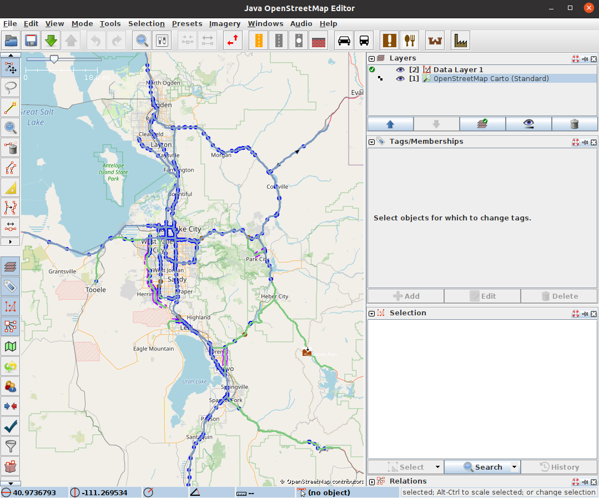
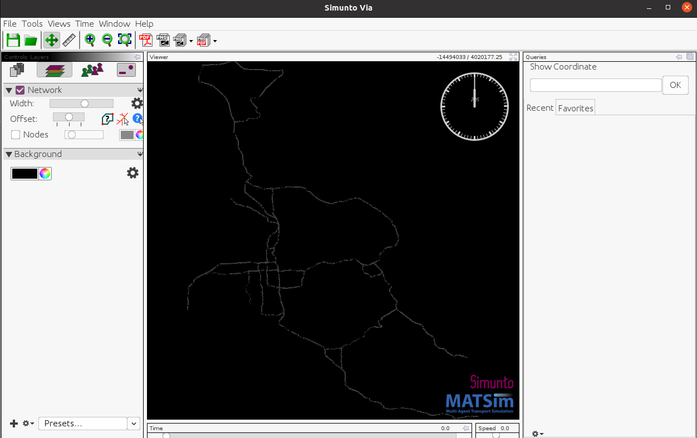

# EV
Electric Vehicle functionality for MATSim

Once you have maven 3.8* installed and the Java JDK 21.* setup, run the following to compile the program

```bash
cd EvMatsim
mvn clean install -DskipTests
```

# Usage

First you need to create a conda environment with the appropriate dependencies, you may need to change some things based on your cuda
version.

The `./setup_python_env.sh` file located in the `EvMatsim/contribs/rlev/rlev` folder will automatically setup the conda environment for you, again,  you may need to change the cuda version based on 
the specs of your machine.

## Running the Java Server
The `run_ocp_server.sh` file in `rlev/bash_scripts` provides an example for how to run the server.

```bash
export MAVEN_OPTS="-Xmx61G"
mvn exec:java -Dexec.mainClass="org.matsim.contrib.rlev.OCPRewardServer" -Dexec.args="2"
```

The first line allows the java program to utilize up to 61 G of RAM, change this as needed. The `2` provided in the args represents the number of JAVA threads that will be spun up to receive requests from the python client.

## Running the Reinforcement learning python client 

You should always create the same number
of environments for the number of threads on the server for the best performance. Just as with the JAVA server, we provide an example script located at `rlev/bash_scripts/run_ocp.sh` that demonstrates how to run the python client. 

Run 

```bash
python -m rlev.rl_algorithm_ppo -h
```

From the `EvMatsim/contribs/rlev` directory to get descriptions of each of the arguments. Remember to have your conda environment `ppomatsimenv` created by the `setup_python_env.sh` file activated.


# Getting a Real Network in MATSim

Scenario examples are located at `contribs/rlev/scenario_examples`, look at these xml files to get a better understanding on how to setup your simulation.

### Step 1: Download the Network

1. Visit [JOSM's website](https://josm.openstreetmap.de/) and download the `josm-tested.jar` file.
2. Run JOSM with the following command:

   ```bash
   java -jar josm-tested.jar
   ```

3. The JOSM interface should appear:
   
   

4. Enable expert mode by clicking on **View** and checking the **Expert mode** box.

5. Navigate to **File → Download Data**. In the download window, switch to the **Download from Overpass API** tab and enter a query.

### Example Overpass API Query

To download a bounding box of road data for the state of Utah, use:

```plaintext
[out:xml];
(
  way["highway"~"motorway|trunk"](39.647,-112.543,41.894,-111.148); //(min latitude, min longitude, max latitude, max longitude)
);
out body;
>;
out skel qt;
```

You can customize this query to include additional roadway types beyond `motorway` and `trunk`. The [Overpass API documentation](https://wiki.openstreetmap.org/wiki/Overpass_API) has more information.

#### Common Road Types:

- **motorway**: Highways or freeways with controlled access.
- **trunk**: Major roads that aren't motorways.
- **primary**, **secondary**, **tertiary**: Roads of varying levels of importance.
- **residential**: Streets within residential areas.
- **living_street**: Streets primarily for pedestrians with limited vehicle access.
- **service**: Roads for accessing buildings, parking lots, etc.
- **footway**, **cycleway**, **path**: Paths for pedestrians and cyclists.
- **track**: Roads mainly used for agricultural or forestry purposes.
- **unclassified**: Roads without a specific classification.

### Step 2: Edit the Network

In the JOSM editor, you can make sure that roads are connected properly. To display the map background, go to **Imagery → OpenStreetMap Carto (Standard)**.



Once you're satisfied with the network, save it by going to **File → Save As** and choosing `.osm` as the file format.

## Cleaning the .osm File

```bash
conda activate ppomatsimenv
cd contribs/rlev
python -m rlev.scripts.clean_osm_data /path/to/osmfile.osm /path/to/desired/output_network.xml

```

## Converting .osm to MATSim-Compatible .xml

Another bash script is located at `/matsim/osm2matsim.sh`, from the command line

```bash
mvn exec:java -Dexec.mainClass="org.matsim.osm2matsim.Osm2matsim" -Dexec.args="path/to/osmfile.osm path/to/desired/output_network.xml"

```

## Generating a Population

Now that you have a MATSim-compatible network `.xml`, you can generate a population:

```bash
cd contribs/rlev/
python -m rlev.scripts.create_population_ev -h
```

The above command shows arguments for the script.

## Visualizing the Simulation

To visualize the simulation results, use [Via](https://www.simunto.com/via/download.html). The Via runnable is included in this repository. To start it:

```bash
./Via-24.1.0/via
```

You may need a license to use Via. A free license can be obtained [here](https://www.simunto.com/via/licenses/free), which allows visualization of up to 500 agents.

Once Via is open:

1. In the **Controls:** tab, click the paper icon labeled **Data Sources**, then click the `+` icon at the bottom.
2. Navigate to the MATSim output folder and add the `output_network.xml.gz` file.
3. Repeat the process to add the `output_events.xml.gz` file.
4. Switch to the **Controls: Layers** tab, click the `+` icon, select **Network**, and click **Add**. The network should appear.



Next, add the **Vehicle From Events** layer and click **Load Data**. You can adjust the simulation speed at the bottom right of the interface to see green agents moving throughout the day.

